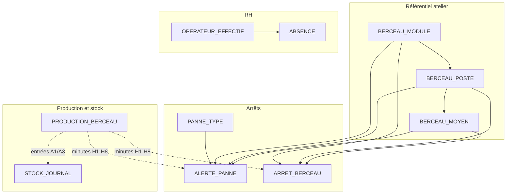

# MCD — Gestion industrielle (UEP Berceau & UEP CCB)

Modèle conceptuel de données dérivé des modèles Django du projet (`app`, `arret`, `production`, `effectif`, `stock`, etc.).

## Vue d’ensemble

L’application couvre **deux unités** (Berceau, CCB) sur des tables partagées, distinguées par le champ `equipe` lorsque nécessaire.


| Domaine             | Entités principales                                  |
| ------------------- | ---------------------------------------------------- |
| Sécurité            | Utilisateur, Profil d’accès                          |
| Effectif            | Opérateur effectif                                   |
| Référentiel Berceau | Module → Poste → Moyen, Type de panne                |
| Arrêts              | Arrêt Berceau (legacy), Alerte panne (Berceau + CCB) |
| Production          | Production Berceau, Production CCB                   |
| Stock               | Journal de stock                                     |
| RH                  | Absence                                              |
| Qualité / suivi     | Mode dégradé                                         |


---

## Diagramme entité–association (Mermaid)

```mermaid
erDiagram
    UTILISATEUR ||--o| PROFIL_ACCES : "possède"
    PROFIL_ACCES }o--o| OPERATEUR_EFFECTIF : "lié (PSP)"

    OPERATEUR_EFFECTIF ||--o{ OPERATEUR_EFFECTIF : "PSP responsable"
    OPERATEUR_EFFECTIF ||--o{ ABSENCE : "absent"
    OPERATEUR_EFFECTIF ||--o{ ABSENCE : "remplaçant"

    BERCEAU_MODULE ||--o{ BERCEAU_POSTE : "contient"
    BERCEAU_POSTE ||--o{ BERCEAU_MOYEN : "équipe"

    BERCEAU_MODULE ||--o{ ARRET_BERCEAU : "localise"
    BERCEAU_POSTE ||--o{ ARRET_BERCEAU : "localise"
    BERCEAU_MOYEN ||--o{ ARRET_BERCEAU : "concerne"

    BERCEAU_MODULE ||--o{ ALERTE_PANNE : "localise"
    BERCEAU_POSTE ||--o{ ALERTE_PANNE : "localise"
    BERCEAU_MOYEN |o--o{ ALERTE_PANNE : "concerne (opt.)"
    PANNE_TYPE ||--o{ ALERTE_PANNE : "type"

    UTILISATEUR ||--o{ PANNE_TYPE : "met à jour"
    UTILISATEUR ||--o{ ARRET_BERCEAU : "met à jour"
    UTILISATEUR ||--o{ ALERTE_PANNE : "met à jour"
    UTILISATEUR ||--o{ ABSENCE : "met à jour"
    UTILISATEUR ||--o{ MODE_DEGRADE : "met à jour"
    UTILISATEUR ||--o{ STOCK_JOURNAL : "met à jour"
    UTILISATEUR ||--o{ OPERATEUR_EFFECTIF : "met à jour"

    PRODUCTION_BERCEAU }o..o{ ARRET_BERCEAU : "agrège arrêts (logique)"
    PRODUCTION_BERCEAU }o..o{ ALERTE_PANNE : "agrège arrêts Berceau (logique)"
    PRODUCTION_CCB }o..o{ ALERTE_PANNE : "agrège arrêts CCB (logique)"
    STOCK_JOURNAL }o..o{ PRODUCTION_BERCEAU : "entrées calculées (logique)"
    STOCK_JOURNAL }o..o{ PRODUCTION_CCB : "entrées calculées (logique)"

    UTILISATEUR {
        int id PK
        string username UK
        string email
        string password
    }

    PROFIL_ACCES {
        int id PK
        int user_id FK UK
        string role "PSP|RU|ADMIN"
        int effectif_id FK
    }

    OPERATEUR_EFFECTIF {
        int id PK
        string nom_complet
        string shift "A|B|N"
        string cin UK
        string identifiant UK
        string matricule
        string equipe "Berceau|CCB"
        string fonction "PSP|OPERATEUR"
        int psp_lead_id FK
        string code_equipe
        bool is_deleted
    }

    BERCEAU_MODULE {
        int id PK
        string name UK
        bool is_active
    }

    BERCEAU_POSTE {
        int id PK
        int module_id FK
        string name
        bool a1_enabled
        bool a3_enabled
        bool is_active
    }

    BERCEAU_MOYEN {
        int id PK
        int poste_id FK
        string name
        bool is_active
    }

    PANNE_TYPE {
        int id PK
        string name UK
        text description
        bool is_active
    }

    ARRET_BERCEAU {
        int id PK
        int module_id FK
        int poste_id FK
        int moyen_id FK
        date date
        string shift
        int heure_production "1-8"
        int temps_arret_min
        string category
        text commentaire
    }

    ALERTE_PANNE {
        int id PK
        int module_id FK
        int poste_id FK
        int moyen_id FK "nullable"
        int panne_type_id FK
        date date
        string shift
        int heure_production "1-8"
        int temps_arret_min
        string equipe "Berceau|CCB"
        string category
        text cause
        text solution
        bool is_deleted
    }

    PRODUCTION_BERCEAU {
        int id PK
        date date
        string shift
        string line "A1|A3 (majoritaire)"
        int objectif
        int volume
        int rebut
        int retouche
        int temps_arrets
        int objectif_h1_h8
        int production_h1_h8
        int line_h1_h8 "A1|A3 par heure"
        int rebut_h1_h8
        int retouche_h1_h8
        int temps_arrets_h1_h8
        int validated_hours_mask
    }

    PRODUCTION_CCB {
        int id PK
        date date
        string shift
        int objectif
        int volume
        int rebut
        int retouche
        int temps_arrets
        int production_h1_h8
        int rebut_h1_h8
    }

    STOCK_JOURNAL {
        int id PK
        date date
        string equipe "Berceau|CCB"
        string line "A1|A3|null"
        int stock_debut
        int entree_calculee
        int sortie_montage
        int stock_fin
        bool is_closed
        string note
    }

    ABSENCE {
        int id PK
        string equipe "Berceau|CCB"
        int effectif_id FK
        int remplacant_effectif_id FK
        string shift
        date date_absence
        string motif
        string remplacant "externe"
        string migration_status
        bool is_deleted
    }

    MODE_DEGRADE {
        int id PK
        string equipe "Berceau|CCB"
        string shift
        date date
        date delai
        string action
        string probleme
        string pilote
        string cause
        string statut
        bool is_deleted
    }
```


> Les liens en pointillés (`}o..o{`) sont des **dépendances métier** sans clé étrangère en base : calculs à l’enregistrement ou à l’affichage (dashboard, KPI, stock).

---

## Cardinalités et contraintes d’intégrité

### Référentiel Berceau (hiérarchie atelier)


| Association    | Cardinalité | Contrainte                      |
| -------------- | ----------- | ------------------------------- |
| MODULE — POSTE | 1,N         | `(module_id, name)` unique      |
| POSTE — MOYEN  | 1,N         | `(poste_id, name)` unique       |
| POSTE → MODULE | N,1         | Cohérence imposée en validation |


### Arrêts


| Association                          | Cardinalité | Notes                                                                                 |
| ------------------------------------ | ----------- | ------------------------------------------------------------------------------------- |
| ALERTE_PANNE → MODULE, POSTE         | N,1         | `moyen` optionnel                                                                     |
| ALERTE_PANNE → PANNE_TYPE            | N,1         | Types partagés Berceau/CCB                                                            |
| ARRET_BERCEAU → MODULE, POSTE, MOYEN | N,1         | Fiche « arrêt structuré » ; scope unique `(module, poste, moyen, date, shift, heure)` |
| ALERTE_PANNE                         | —           | `equipe` = Berceau ou CCB ; diversité A1/A3 dans `cause` (`[diversite:…]`)            |


### Production


| Entité             | Unicité métier              | Lien arrêts                                                           |
| ------------------ | --------------------------- | --------------------------------------------------------------------- |
| PRODUCTION_BERCEAU | **1 fiche / (date, shift)** | Somme `ArretBerceau` + `AlertePanne` (equipe=Berceau) par heure H1–H8 |
| PRODUCTION_CCB     | **1 fiche / (date, shift)** | Somme `AlertePanne` (equipe=CCB)                                      |


### Stock


| Entité        | Unicité                                       |
| ------------- | --------------------------------------------- |
| STOCK_JOURNAL | `(date, equipe, line)` — `line` null pour CCB |


Les **entrées** (`entree_calculee`, répartition A/B/N) sont **dérivées** de la production (par diversité A1 ou A3 pour Berceau).

### Effectif & absences


| Association                                   | Cardinalité                               |
| --------------------------------------------- | ----------------------------------------- |
| OPERATEUR_EFFECTIF — OPERATEUR_EFFECTIF (PSP) | 0,1 chef → 0,N membres                    |
| ABSENCE — OPERATEUR (absent)                  | N,1                                       |
| ABSENCE — OPERATEUR (remplaçant)              | N,1 optionnel si remplaçant externe saisi |


Contrainte métier : `(effectif, date_absence, equipe)` unique (absence par personne et jour).

### Authentification


| Association                       | Cardinalité            |
| --------------------------------- | ---------------------- |
| UTILISATEUR — PROFIL_ACCES        | 1,1                    |
| PROFIL_ACCES — OPERATEUR_EFFECTIF | 0,1 (surtout rôle PSP) |


Rôles : **PSP** (shift verrouillé), **RU** (lecture/écriture élargie), **ADMIN**.

---

## Schéma simplifié (cœur métier Berceau)




---

## Discriminateur `equipe`

Entités **multi-UEP** sur une même table :

- `OPERATEUR_EFFECTIF.equipe`
- `ABSENCE.equipe`
- `ALERTE_PANNE.equipe` (Berceau vs CCB)
- `MODE_DEGRADE.equipe`
- `STOCK_JOURNAL.equipe`

Les écrans **CCB** réutilisent `AlertePanne` et des modèles miroirs (`effectif_ccb`, `absence_ccb`, …) pointant vers les **mêmes tables** (`app_operateureffectif`, `app_absence`, …).

---

## Fichiers source


| Entité MCD             | Fichier Django                    |
| ---------------------- | --------------------------------- |
| Utilisateur            | `django.contrib.auth.models.User` |
| Profil d’accès         | `app/user_access_profile.py`      |
| Opérateur effectif     | `effectif/models.py`              |
| Module / Poste / Moyen | `arret/models.py`                 |
| Type de panne          | `arret/models.py`                 |
| Arrêt Berceau          | `arret/models.py`                 |
| Alerte panne           | `arret/models.py`                 |
| Production Berceau     | `production/models.py`            |
| Production CCB         | `production_ccb/models.py`        |
| Journal stock          | `stock/models.py`                 |
| Absence                | `absence/models.py`               |
| Mode dégradé           | `mode_degrade/models.py`          |


---

## Export diagramme

Pour visualiser le diagramme Mermaid :

- Extension **Markdown Preview Mermaid** dans VS Code / Cursor, ou
- [mermaid.live](https://mermaid.live) (coller le bloc `erDiagram`),
- GitHub/GitLab rendent nativement les blocs Mermaid dans ce fichier.

